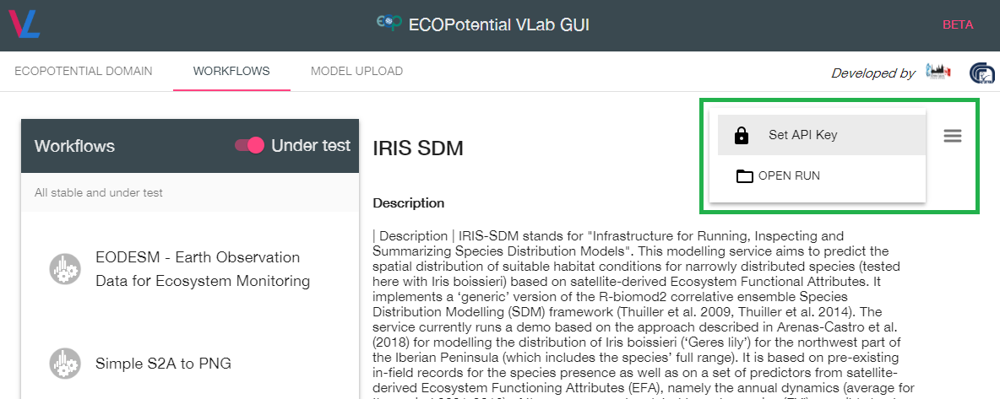
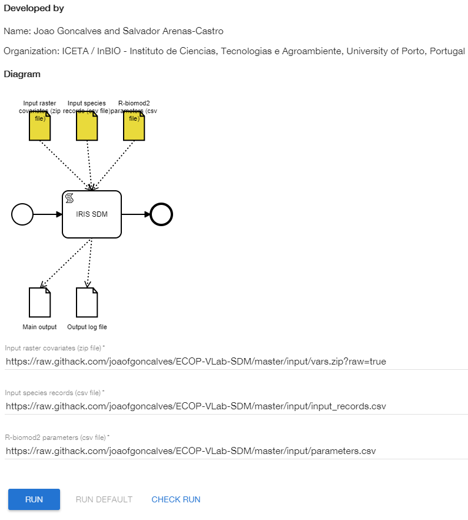

# ECOPOTENTIAL IRIS SDM model/service

Authors: João Gonçalves, Salvador Arenas-Castro & João Honrado
Porto, 2018

## Description

### Main objectives of the IRIS SDM service

IRIS-SDM stands for _"Infrastructure for Running, Inspecting and Summarizing Species Distribution Models"_. This ECOPOTENTIAL VirtualLab service implements a ‘generic’ version of R's _biomod2_ package for ensemble Species Distribution Modelling (SDM) (Thuiller et al. 2009, Thuiller et al. 2014) used to obtain spatiotemporal predictions of species distributions or habitat suitability. The service aims at generality so that any species can be modelled, based on any set of input variables, parameter settings and/or study areas. This is possible due to IRIS SDM's generic code structures.

### The _demo version_ of IRIS SDM

The demonstration (_demo version_) of IRIS SDM allows predicting the spatial distribution of suitable habitat conditions for a narrowly distributed, endemic and endangered plant species named _Iris boissieri_ (_Gerês_ lily or 'Yellowbeard Iris') based on satellite-derived Ecosystem Functional Attributes (EFAs). The study area encompasses the species entire distribution located in the NW portion of the Iberian Peninsula. It is based on pre-existing in-field records for the species presence as well as on a set of predictors from satellite-derived Ecosystem Functioning Attributes, namely the annual dynamics (average for the period 2001-2016) of three components related to carbon gains (EVI), sensible heat (LST) and radiative balance (albedo). For more details about the modelling approach check the paper by Arenas-Castro _et al_. (2018).

### Input Data and Format

IRIS SDM requires three generic inputs for running:

1) a csv file named _input\_records.csv_ containing presence-only records for the target species. The two first columns of this file contain the X and Y coordinates in the same coordinate reference system of the input raster predictor variables in _vars.zip_ (see below);

2) a csv file named _parameters.csv_ containing a set of (hyper)parameter values for running the R _biomod2_ package ensemble modelling approach;

3) a zip file named _vars.zip_ containing a set of GeoTIFF raster files used as predictor variables and therefore with a known linkage to the target species' distribution and habitat suitability. These data must have the same coordinate reference system of the input presence records.

For more information on how to prepare the data and the parameter file, check the demo version data at this [link](https://github.com/joaofgoncalves/ECOP-VLab-SDM/tree/master/input).

_EO data usage in the demo version_: MODIS derived Ecosystem Functional Attributes (EFA) calculated from time series of spectral vegetation indices (MOD13Q1, MOD09A1), land surface temperature (MOD11A1) and albedo (MCD43A1, MCD43B3).

_Other data sources in the demo version_: Species occurrence data for the demo version were collected from pre-existing datasets and/or from dedicated in-field surveys; the algorithm runs with confirmed presence records complemented with pseudo-absences randomly generated by biomod2. However, confirmed absence records may also be used for model calibration. Climatic/bioclimatic data extracted from WorldClim and land cover data from Corine Land Cover (CLC) were also tested/used for a comparative purpose in Arenas-Castro et al. (2018); however, these are optional inputs as the model can be exclusively fitted based on EO variables.

### Output Data and Format

Outputs generated by the service are model-based, spatially-explicit predictions for the distribution of the target species in raster format and GeoTIFF format. Outputs also include tables (in .csv format) containing a summary of model performances for partial and ensemble models as well as an importance ranking for each predictor variable.

Outputs include the following files:

- _Output log file (plain txt)_: this file includes log information about the model/service run namely a list of input files, input data summaries and the progress messages from the _biomod2_ package. This file allows checking if the model was sucessfully run or if any problem occurred at run time;

- _Main output archive (zip file)_: this file includes the bulk of output data produced by the service and more specifically by _biomod2_ package. This includes files with fitted models, raster projections for partial and the final ensemble model and summary tables with model performances and variable importance rankings.

### Running the demo version

- Start by checking if the API key is correctly inserted here:

- To run the demo version using _Iris boissieri_ as the test-species, the NW Iberia as the study area and the pre-defined set of EFA-based predictors you can set the input parameters as:

  - Input raster covariates (zip file):[https://raw.githack.com/joaofgoncalves/ECOP-VLab-SDM/master/input/vars.zip?raw=true](https://raw.githack.com/joaofgoncalves/ECOP-VLab-SDM/master/input/vars.zip?raw=true)

  - Input species records (csv file): [https://raw.githack.com/joaofgoncalves/ECOP-VLab-SDM/master/input/input_records.csv](https://raw.githack.com/joaofgoncalves/ECOP-VLab-SDM/master/input/input_records.csv)

  - R-biomod2 parameters file (csv file): [https://raw.githack.com/joaofgoncalves/ECOP-VLab-SDM/master/input/parameters.csv](https://raw.githack.com/joaofgoncalves/ECOP-VLab-SDM/master/input/parameters.csv)

The input interface should look like this:

Then press __"RUN"__ to initiate the model. Use option __"CHECK RUN"__ to verify the status of the service.

### Running the service with other settings

- Upload the data to a freely accessible web-based cloud service or http/ftp server;

- Get the correct links to every input file required by IRIS SDM;

- Go to ECOP's VirtualLab site ([here](https://vlab.geodab.eu));
  
- Check if the API key is correctly inserted (otherwise it is not possible to run the model);

- Insert the URLs in the VLAb interface and make sure that all inputs are filled in;

- Then press __"RUN"__ to initiate the model. Use option __"CHECK RUN"__ to verify the status of the service.

### ECOPOTENTIAL products used

Currently, the demo version of the service uses several ECOPOTENTIAL products related to satellite-derived Ecosystem Functioning Attributes, namely the annual dynamics (average for the period 2001-2016) of three components linked to carbon gains (EVI), sensible heat (LST) and radiative balance (albedo) computed in the Google Earth Engine platform by project partners.

### Validation

Model performance is evaluated by holdout cross-validation and through the calculation of several threshold-dependent metrics (e.g., Cohen Kappa, True skill-statistic) and threshold-independent metrics (Area Under the Receiver Operating Curve) calculated from the confusion matrix for the test dataset. Formal validation with independent data depends on in-field collection of occurrence data in relevant future dates, for which spatial projections of habitat suitability, can be produced.

### Transferability

The demo version of the service currently provides spatial predictions of habitat suitability of an endemic and narrow-ranged species (_Iris boissieri_), exclusive to NW Iberian Peninsula, for which spatial transferability is not required to other ECOPOTENTIAL sites. The demo service also provides spatial predictions for the entire species range (NW Iberia). Although issues related to the model temporal transferability for the demo species were not specifically addressed, it is reasonable to use the same model to make predictions to other (past or future) dates using the same set of predictors computed with the same methodology. However, it is reasonable to assume that uncertainty will increase as time goes further from the calibration interval (2001-2016).

Despite the specificities of modelling the species of the service's demo version, with its particular distribution range and ecological requirements, the service should be capable of providing relevant outputs for other target species, different settings and/or environmental conditions.

### Known limitations

- At this stage, the model only provides predictions for calibration/fitting conditions. This means that making projections for other spatial and/or temporal conditions is not (yet) possible;

- By default, IRIS SDM assumes that a presence-only approach is used;

- QA/QC was not formally assessed.

### Programming language

R (mainly including the raster and biomod2 packages, along with their dependencies) and Linux bash.

### Relevant references, materials or publications

Arenas-Castro, S., Gonçalves, J., Alves, P., Alcaraz-Segura, D., & Honrado, J. P. (2018). Assessing the multi-scale predictive ability of ecosystem functional attributes for species distribution modelling. PloS one, 13(6), e0199292.

Carvalho-Santos, C., Monteiro, A., Arenas-Castro, S., Greifeneder, F., Marcos, B., Portela, A., & Honrado, J. (2018). Ecosystem Services in a Protected Mountain Range of Portugal: Satellite-Based Products for State and Trend Analysis. Remote Sensing, 10(10), 1573.

Thuiller, W., Lafourcade, B., Engler, R., & Araújo, M. B. (2009). BIOMOD–a platform for ensemble forecasting of species distributions. Ecography, 32(3), 369-373.

Thuiller, W., Georges, D., Engler, R., 2014. biomod2: Ensemble platform for species distribution modeling, R package version 3.1-48, URL: [http://CRAN.R-project.org/package=biomod2](http://CRAN.R-project.org/package=biomod2).

### Intellectual Property Rights (IPR)

IPR are under the CC-BY-NC 2.0 license.

### ECOPOTENTIAL Partner

ICETA / CIBIO / InBIO - Instituto de Ciências, Tecnologias e Agroambiente, University of Porto, Portugal [link-1](https://cibio.up.pt/) [link-2](http://inbio-la.pt/) [link-3](http://www.iceta.up.pt/)